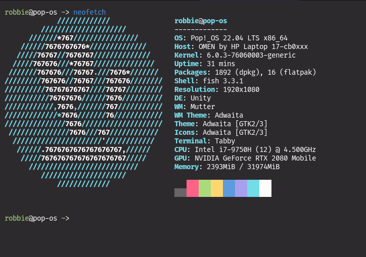

# Monokai Pro for [Tabby](https://github.com/Eugeny/tabby).
<p align="center">
	
</p>

## How to use:

1. Navigate to ```~/.config/tabby/config.yaml```;
2. Replace ```.terminal.customColorSchemes[]``` with the contents of ```monokai-pro-tabby.yaml```.
